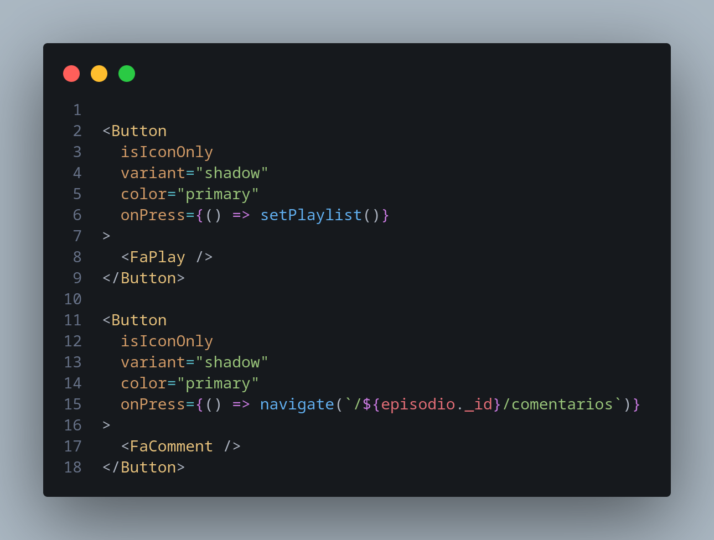
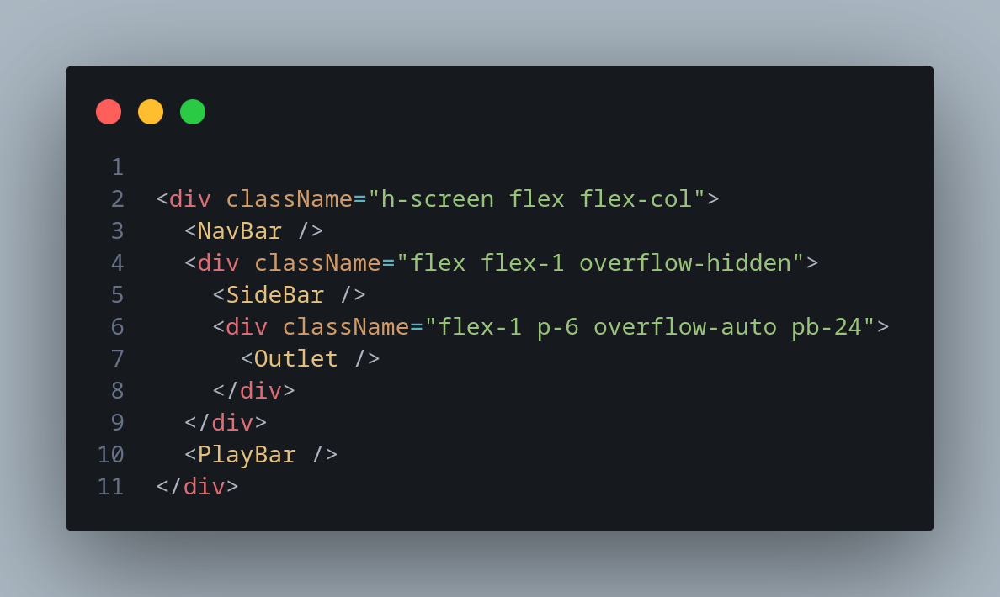
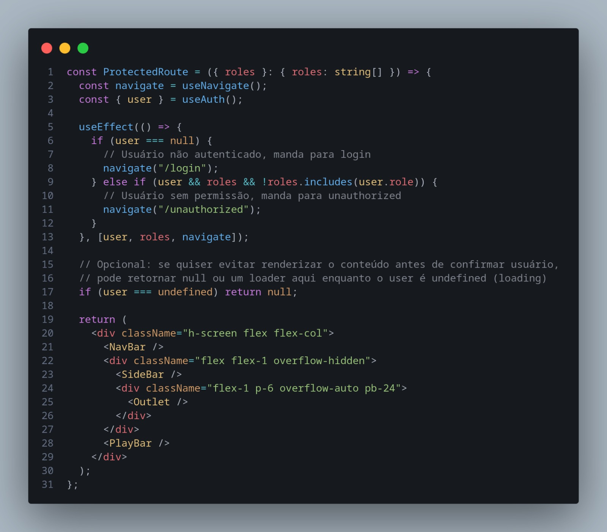
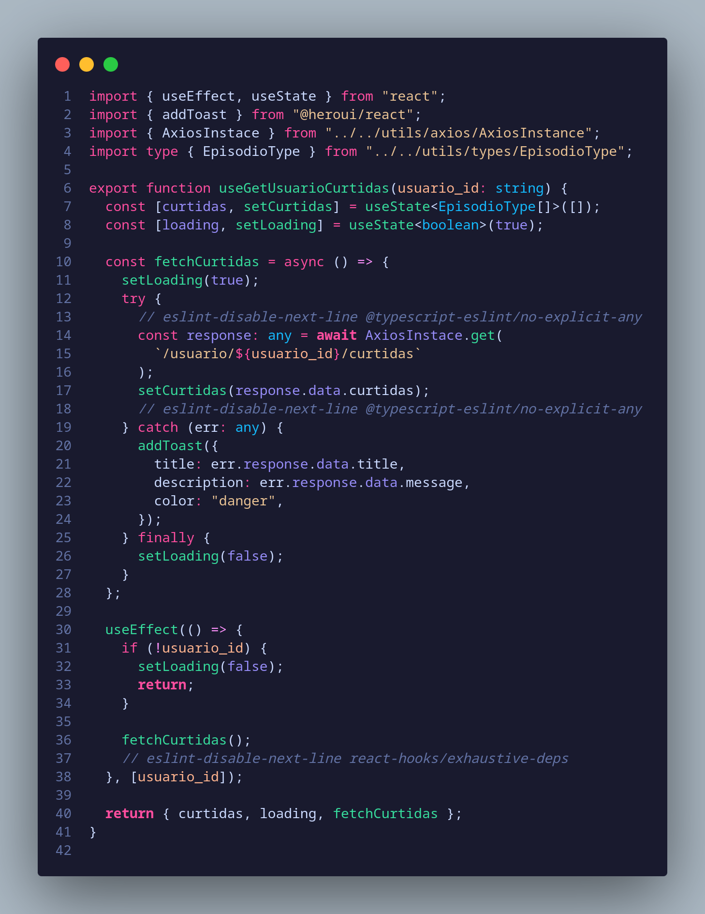

# 4.2. Módulo Reutilização de Software

<!-- SEGUNDA OPÇÃO DE ENTREGA: Reutilização de Software

Entrega Mínima: Exemplo de Reutilização, evidenciando parte conceitual e código. Mostrar código comprobatório & execução (RODANDO) de algo que evidencie padrões e estilos arquiteturais.

Apresentação (para a professora) conferindo reflexões sobre reutilização de software no escopo da aplicação, com: (i) rastro claro aos membros participantes (MOSTRAR QUADRO DE PARTICIPAÇÕES & COMMIITS); (ii) justificativas & senso crítico sobre reutilização de software, e (iv) comentários gerais sobre o trabalho em equipe. Tempo da Apresentação: +/- 7min. Recomendação: Apresentar diretamente via Wiki ou GitPages do Projeto. Baixar os conteúdos com antecedência, evitando problemas de internet no momento de exposição nas Dinâmicas de Avaliação. Mostrar rodando.

A Wiki ou GitPages do Projeto deve conter um tópico dedicado ao Módulo Reutilização de Software, com exemplo de reutilização de software (parte conceitual & código), histórico de versões, referências, e demais detalhamentos gerados pela equipe nesse escopo.

Demais orientações disponíveis nas Diretrizes (vide Aprender3). -->

## Atomic Design

## Atomic Design

Desde o início do projeto, o time adotou o **Atomic Design** como uma de suas diretrizes fundamentais, com o objetivo de promover a reutilização de código e componentes de forma consistente. Com base nessa abordagem, utilizamos a biblioteca de CSS [**HeroUI**](https://www.heroui.com/), que também segue os princípios do Atomic Design, permitindo a customização e o desenvolvimento de uma biblioteca de componentes própria.

Essa estratégia evita a necessidade de recriar ou redefinir elementos em cada tela do sistema, contribuindo para a padronização visual, o ganho de eficiência no desenvolvimento e a escalabilidade da aplicação.

Como exemplo, destacam-se os seguintes elementos reutilizáveis:

### Botões

### Layout Base do Site

## Solução flexível e extensível

➡️ React:

Componentes React são extensíveis via:

Props (pontos de personalização).

Composição (componentes dentro de outros).

Context API ou hooks personalizados.

## HotsSpots e FrozenSpots

➡️ React:

Conceito do PDF	Exemplo em React
Hot-Spots	Props como children, onClick, style.
Frozen-Spots	Estrutura interna do componente, layout fixo, regras internas.

### Códigos do Hot-Spot:

O campo podcast.titulo é considerado um hot-spot porque representa uma parte do componente que é flexível e personalizável conforme o uso. Em vez de conter um valor fixo ou estático, esse campo é preenchido dinamicamente com o título de cada podcast fornecido ao componente, permitindo que o mesmo código seja reutilizado para exibir diferentes conteúdo. O campo podcast.autor.nome também é um hot-spot porque representa uma informação dinâmica e personalizada dentro de um componente reutilizável. Ele é preenchido com o nome do autor do podcast, que pode variar de acordo com os dados recebidos, permitindo que o mesmo componente seja utilizado para diferentes autores sem alterar sua estrutura. O campo podcast.tags.join é um hot-spot porque permite a exibição dinâmica e personalizada das tags associadas a cada podcast. Ele recebe um array de tags e as transforma em uma string separada por vírgulas, exibindo informações específicas que variam conforme os dados do podcast.

### Código do Cold-Spot: 

Essa parte é um exemplo de cold-spot que está no código que representa a parte fixa e padronizada do componente. Definindo o layout, o posicionamento dos elementos e o comportamento visual do conteúdo que será exibido, independentemente dos dados fornecidos ao componente. As classes Tailwind aplicadas são decisões de estilo e organização que garantem consistência visual e estrutural entre diferentes instâncias do componente, tornando essa parte congelada e não personalizável durante o uso

## Composite Pattern
## Higher-Order Components (HOCs)

### ProtectedRoute

**ProtectedRoute** é um componente funcional que protege as rotas com o foco em permitir somente usuários autenticados e autorizados possam acessar determinadas seções da aplicação.

### Objetivo

Este componente encapsula lógica de controle de acesso baseada em dois críterios princípais:

 - **1.** Autenticação: O usuário precisa estar logado (não pode ser null) .

 - **2.** Autorização: O usuário precisa ter um **role** (papel) incluindo na lista de **roles** permitidos (Aluno/Professor).

 É necessário que essas condições sejam aceitas porque se qualquer uma falhar, o usuário é redirecionado para:
 - **/login** **->** caso não esteja autenticado.
 - **/unauthorized** **->** se estiver autenticado, mas sem permissão.

### Props

| Prop  | Tipo       | Descrição |
|-------|------------|-----------|
| roles | `string[]` | Lista de papéis autorizados a acessar o conteúdo protegido. |

### Funcionamento Interno

Hook **useAuth():** Recupera o objeto user atual (ex:{id, name, role}). Esse estado pode assumir:

- **undefined:** Ainda carregando (evita renderizar antes de concluir).

- **null:** Não autenticado.

- **objeto válido:** usuário logado.

Hook **useNavigate():** usado para redirecionar via React Router.

Efeito colateral (**useEffect**): monitora user, roles e navigate. Assim que o user estiver definido, o componente valida seu acesso e redireciona se necessário.

Controle de renderização inicial: se user for undefined, retorna null para evitar flicker ou renderização prematura da interface antes de saber se há um usuário logado.

O **ProtectedRoute** é um componente de ordem superior, apesar de não ser um **HOC** no formato clássico ele adiciona a lógica de controle de acesso a outras rotas e componentes, é reutilizável, pois basta passar uma lista de roles autorizadas. Encapsula comportamento de redirecionamento baseado em autenticação autorização.

## Hooks

### useGetUsuarioCurtidas

O hook **useGetUsuarioCurtidas** tem como função buscar, armazenar e disponibilizar a lista de episódios curtidos por um usuário com base no **usuario_id**. Ele tambémm gerencia o estado de carregamento da requisição e exibe mensagens de erro quando necessário. Criamos este hook também para evitar a duplicação de código e centraliza o controle da lógica de carregamento e erro em um único local reutilizável.

### Objetivo principal

Este hook tem como finalidade:

- Buscar automaticamente os episódios curtidos por um determinado usuário ao receber seu **usuario_id**;

- Gerenciar estados locais como o carregamento assíncrono (loading) e os dados obtidos (curtidos);

- Trata erros, utilizando um sistema de notificação (**addToast**);

- Permitir que a lógica de fetch seja reutilizável, oferecendo a função **fetchCurtidas**.

### Como ele funciona internamente

- **1.** Gerenciamento de estado com **useState**

O React Hook **useState** é utilizado para:

- Armazenar a lista de curtidas (curtidas), que é um array do tipo **EpisodioType**. 

- Controlar o estado de carregamento (loading), que indica se os dados estão sendo carregados ou não.

Esses estados são controlados e atualizados conforme as mudanças no **usuario_id** e os ciclos de requisição HTPP.

- **2.** Função de busca assíncrona

A função **fetchCurtidas** é definida dentro do hook e é responsável por:

- Iniciar a requisição (**setLoading(true)**);

- Fazer a chamada HTTP usando o **AxiosInstance**;

- Armazenar os dados obtidos na variável de estado (**setCurtidos**);

- Exibir mensagens de erro com **addToast** em caso de falhas;

- Finalizar o carregamento (**setLoading(false)**), independentemente do sucesso ou erro.

**Essa função é exposta pelo hook para permitir que o componente possa refazer a requisição manualmente sempre que necessário.**

 

## Caixa Cinza

## Instanciação Composição

## Empacotamento
- **Pacotes npm**:

O projeto utiliza o npm, gerenciador de pacotes padrão do Node.js, para instalar e atualizar bibliotecas necessárias. As dependências são definidas no package.json e travadas no package-lock.json localizadas tanto no frontend quanto no backend, garantindo a instalação das mesmas versões em qualquer ambiente.

[Documentação npm](https://docs.npmjs.com/about-npm)

[Documentação de npm sobre Pacotes](https://docs.npmjs.com/about-packages-and-modules)

- **Builder do Vite**:

No frontend, é utilizado o Vite como ferramenta de build, configurado pelo arquivo vite.config.ts. Ele facilita a integração com React, gera builds otimizados e auxilia no desenvolvimento do projeto.

[Documentação Vite](https://v3.vitejs.dev/guide/why.html)

## Reutilizável, Extensível, Seguro, Direcionado ao Domínio

Reutilizável: Props, hooks, composição.

Extensível: Possibilidade de sobrescrever estilos ou comportamentos.

Seguro: Encapsulamento evita que o usuário do componente quebre sua estrutura.

Direcionado: Bibliotecas de componentes específicos para o domínio (ex.: barra de play).

## Referências

- [React – Higher-Order Components (Documentação Oficial)](https://pt-br.legacy.reactjs.org/docs/higher-order-components.html)
- [React – Hooks: Introdução (Documentação Oficial)](https://legacy.reactjs.org/docs/hooks-intro.html)

| Versão |    Data    |        Descrição         |    Autor(es)    |  Revisor(es)     |  Detalhes da Revisão  |  
| :----: | :--------: | :----------------------: | :-------------: | :----------------| :---------------------|
|  1.0   | 03/07/2025 |   Criação do documento   | Gustavo Costa |      ||
|  1.1   | 03/07/2025 |   Adição documentação HOC   | Iderlan J. |      ||
|  1.2   | 03/07/2025 |   Adição documentação Hooks   | Iderlan J. |      ||