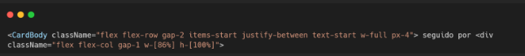

# 4.2. Módulo Reutilização de Software

<!-- SEGUNDA OPÇÃO DE ENTREGA: Reutilização de Software

Entrega Mínima: Exemplo de Reutilização, evidenciando parte conceitual e código. Mostrar código comprobatório & execução (RODANDO) de algo que evidencie padrões e estilos arquiteturais.

Apresentação (para a professora) conferindo reflexões sobre reutilização de software no escopo da aplicação, com: (i) rastro claro aos membros participantes (MOSTRAR QUADRO DE PARTICIPAÇÕES & COMMIITS); (ii) justificativas & senso crítico sobre reutilização de software, e (iv) comentários gerais sobre o trabalho em equipe. Tempo da Apresentação: +/- 7min. Recomendação: Apresentar diretamente via Wiki ou GitPages do Projeto. Baixar os conteúdos com antecedência, evitando problemas de internet no momento de exposição nas Dinâmicas de Avaliação. Mostrar rodando.

A Wiki ou GitPages do Projeto deve conter um tópico dedicado ao Módulo Reutilização de Software, com exemplo de reutilização de software (parte conceitual & código), histórico de versões, referências, e demais detalhamentos gerados pela equipe nesse escopo.

Demais orientações disponíveis nas Diretrizes (vide Aprender3). -->

## Atomic Design

(explicar a decisão)
(exemplos)

## Solução flexível e extensível

➡️ React:

Componentes React são extensíveis via:

Props (pontos de personalização).

Composição (componentes dentro de outros).

Context API ou hooks personalizados.

## HotsSpots e FrozenSpots

➡️ React:

Conceito do PDF	Exemplo em React
Hot-Spots	Props como children, onClick, style.
Frozen-Spots	Estrutura interna do componente, layout fixo, regras internas.

Códigos do Hot-Spot:

O campo podcast.titulo é considerado um hot-spot porque representa uma parte do componente que é flexível e personalizável conforme o uso. Em vez de conter um valor fixo ou estático, esse campo é preenchido dinamicamente com o título de cada podcast fornecido ao componente, permitindo que o mesmo código seja reutilizado para exibir diferentes conteúdo. O campo podcast.autor.nome também é um hot-spot porque representa uma informação dinâmica e personalizada dentro de um componente reutilizável. Ele é preenchido com o nome do autor do podcast, que pode variar de acordo com os dados recebidos, permitindo que o mesmo componente seja utilizado para diferentes autores sem alterar sua estrutura. O campo podcast.tags.join é um hot-spot porque permite a exibição dinâmica e personalizada das tags associadas a cada podcast. Ele recebe um array de tags e as transforma em uma string separada por vírgulas, exibindo informações específicas que variam conforme os dados do podcast.

Código do Cold-Spot: 

Essa parte é um cold-spot, pois representa a parte fixa e padronizada do componente. Definindo o layout, o posicionamento dos elementos e o comportamento visual do conteúdo que será exibido, independentemente dos dados fornecidos ao componente.

## Composite Pattern
## Higher-Order Components (HOCs)

## Hooks

## Caixa Cinza

## Instanciação Composição

## Empacotamento

- pacotes npm
- builder do vite

## Reutilizável, Extensível, Seguro, Direcionado ao Domínio

Reutilizável: Props, hooks, composição.

Extensível: Possibilidade de sobrescrever estilos ou comportamentos.

Seguro: Encapsulamento evita que o usuário do componente quebre sua estrutura.

Direcionado: Bibliotecas de componentes específicos para o domínio (ex.: barra de play).
