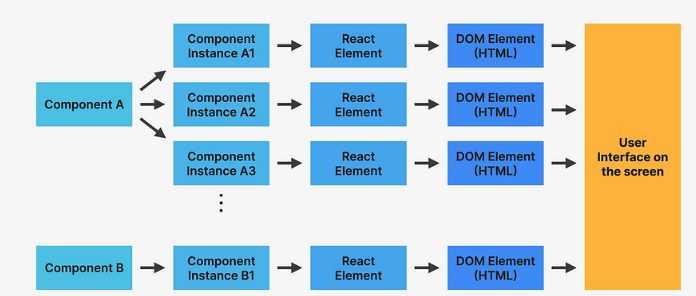
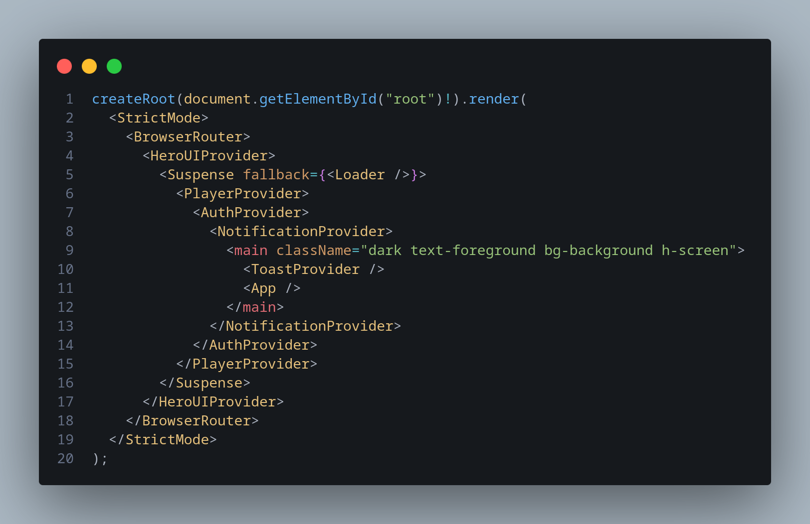
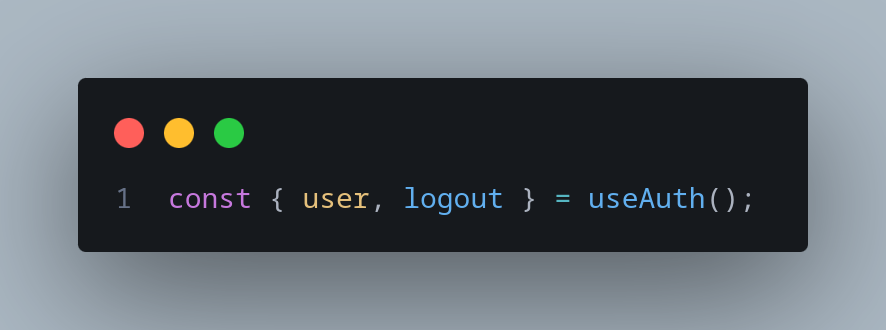
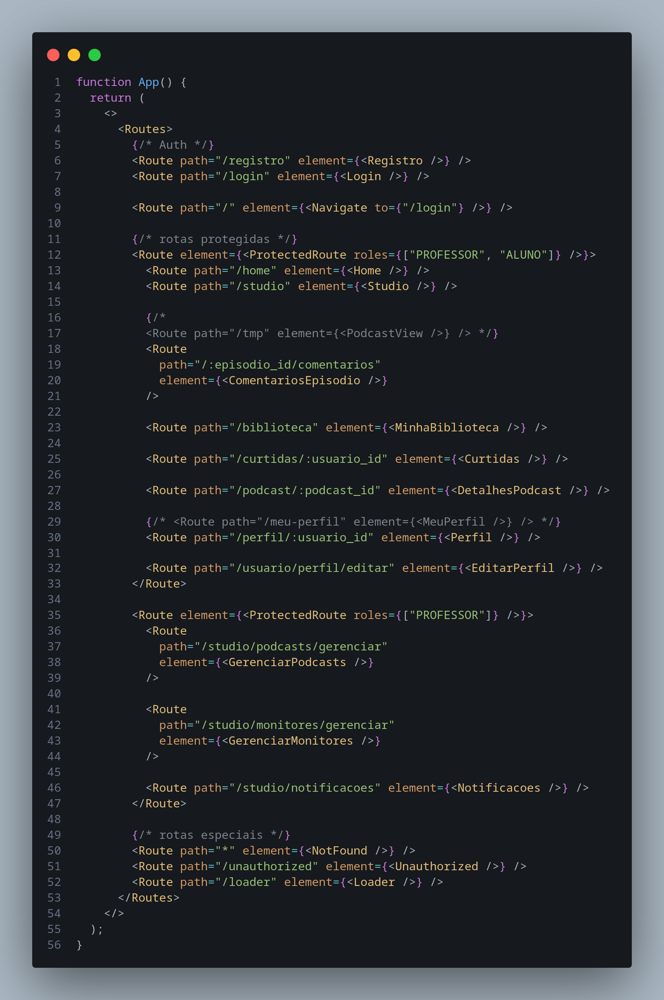
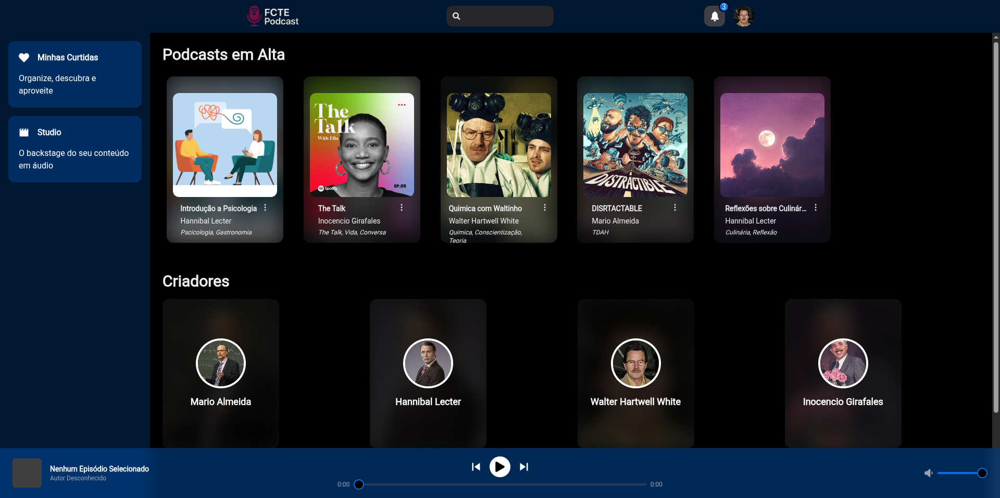
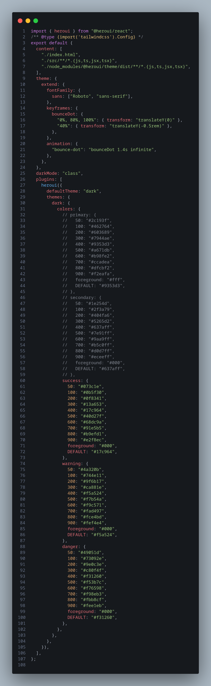
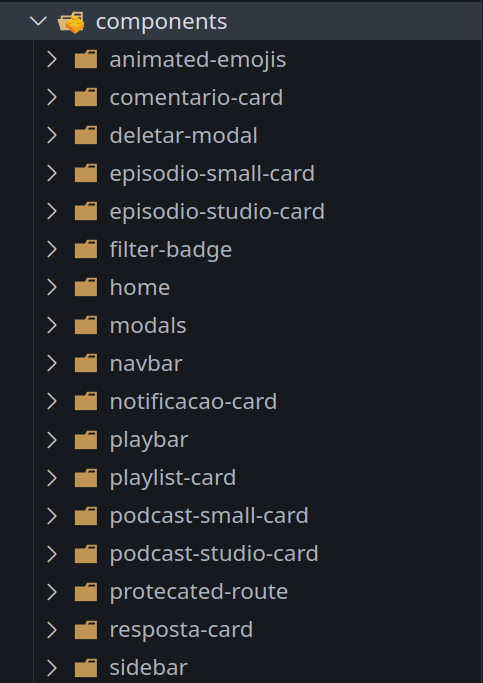

# Detalhes Técnicos

Nesta seção, abordaremos a aplicação de maneira mais técnica e aprofundada, apresentando exemplos e evidências concretas da arquitetura componentizada e reutilizável adotada no projeto.

O React não é apenas um framework focado em interface, sua estrutura é fortemente baseada no conceito de árvore de componentes, o que naturalmente incentiva boas práticas de modularização e reaproveitamento de código.

Na imagem acima, podemos visualizar como o processo de renderização do React segue esse modelo hierárquico. A renderização começa no componente principal (geralmente chamado de root ou App), que por sua vez instancia e organiza seus subcomponentes, formando uma estrutura em árvore.

Cada componente, ao ser renderizado, pode conter outros componentes, que seguem o mesmo ciclo, até que a estrutura final seja traduzida em elementos do [**DOM (Document Object Model)**](https://pt-br.legacy.reactjs.org/docs/react-dom.html) e exibida no navegador do usuário.

Essa organização não é apenas uma questão de estrutura visual, mas também está diretamente relacionada à otimização do desempenho da aplicação. O React utiliza esse modelo para aplicar técnicas como o [**Virtual DOM**](https://legacy.reactjs.org/docs/faq-internals.html) e a renderização seletiva, garantindo que apenas as partes da interface que realmente sofreram alterações sejam atualizadas, evitando renderizações desnecessárias.

## Estrutura da Aplicação FCTEPodcast

### root

Desde o início do desenvolvimento, a aplicação foi projetada seguindo o princípio da reutilização de componentes, o que garante maior escalabilidade, organização e eficiência no código.

Na imagem acima, podemos observar a estrutura da raiz da aplicação. Componentes como:

- Suspense
- AuthProvider
- PlayerProvider
- ToastProvider

são declarados no nível mais alto da aplicação. Isso significa que seus recursos, estados e métodos ficam disponíveis de forma global, permitindo que qualquer parte da aplicação os utilize sem a necessidade de redefinir lógica ou repetir código.

Essa abordagem facilita a manutenção e evita duplicação, além de seguir as melhores práticas recomendadas pelo ecossistema React.

Um exemplo prático dessa estratégia pode ser visto na imagem acima. Em diversos pontos da aplicação, é necessário acessar informações do usuário, como nome, e-mail, ou realizar ações como login e logout.

Para isso, implementamos o Context personalizado useAuth, que encapsula toda a lógica relacionada à autenticação. Com ele, qualquer componente pode acessar esses dados ou métodos de forma simples e padronizada, sem a necessidade de reescrever a mesma lógica em cada tela.

Essa estrutura demonstra como o conceito de reutilização foi aplicado de maneira concreta, contribuindo para um código mais limpo, consistente e fácil de manter.

### Roteador interno

Na camada seguinte da aplicação, definimos o sistema de rotas. Para isso, utilizamos a biblioteca [**React Router**](https://reactrouter.com/home), que fornece os componentes Router e Route, permitindo estruturar e reaproveitar as rotas de forma organizada e eficiente.

Na imagem acima, é possível visualizar a estrutura básica de roteamento da aplicação, onde as rotas são declaradas de maneira clara e componentizada.

Outro ponto de destaque é o componente principal da aplicação, responsável não apenas pelo layout global, mas também pelo controle de acesso às páginas.

O **ProtectedRoute** é o componente central dessa estrutura. Ele atua em duas frentes fundamentais:

- **Controle de acesso**: Verifica se o usuário está autenticado e autorizado a acessar determinadas rotas.

- **Definição do layout global**: Estabelece a estrutura visual comum a todas as páginas da aplicação.

A estrutura interna desse componente segue o seguinte padrão:

1. A **div mais externa** ocupa toda a área disponível da tela do usuário.

2. Dentro dela, renderizamos três componentes principais:

    - **NavBar**: Barra de navegação superior.

    - **SideBar**: Menu lateral da aplicação.

    - **PlayBar**: Barra inferior de controle de mídia, presente em todas as telas.
  

**Assim, garantimos que em todas as páginas a estrutura será a mesma.**

## Padronização da Paleta de Cores

A combinação do [**HeroUI**](https://www.heroui.com/) com o [**TailwindCSS**](https://v3.tailwindcss.com/) nos proporciona ferramentas extremamente poderosas para garantir um design consistente, moderno e, principalmente, reutilizável em toda a aplicação.

Desde as primeiras etapas do projeto, a definição da paleta de cores foi um ponto amplamente discutido pelo time. Após diversas análises e debates, optamos por utilizar o azul como cor principal. Apesar disso, o tema segue aberto a ajustes conforme o projeto evolui e novas necessidades ou percepções surgirem.

Para garantir flexibilidade e facilitar futuras alterações, modelamos a paleta de cores diretamente nos arquivos de configuração do TailwindCSS. Essa abordagem permite que as cores sejam tratadas como tokens reutilizáveis, aplicáveis em qualquer parte da aplicação sem a necessidade de definições manuais ou repetitivas.

Dessa forma, caso seja necessário alterar a identidade visual do projeto no futuro, basta modificar os valores centralizados na configuração, propagando automaticamente as mudanças por toda a aplicação, sem a necessidade de refatorações extensas.

Essa prática não só reforça o compromisso com a padronização e a escalabilidade do design, como também evidencia o foco em reutilização e manutenção facilitada, princípios centrais na arquitetura do projeto.

## Componentes

Como destacado ao longo de toda a documentação, a aplicação foi desenvolvida com foco total na arquitetura baseada em componentes, um dos pilares fundamentais do ecossistema React.

Cada funcionalidade, seção ou comportamento da interface foi cuidadosamente encapsulado em componentes reutilizáveis, garantindo modularidade, consistência visual e facilidade de manutenção.

Embora o grupo tenha desenvolvido uma grande variedade de componentes ao longo do projeto, listar todos em detalhes exigiria um espaço muito maior do que o escopo desta documentação permite.

Abaixo, apresentamos a estrutura da pasta de componentes da aplicação, evidenciando a organização adotada e a quantidade de elementos criados:

## Conclusão

O restante da aplicação segue os princípios e práticas abordados na seção [**Reutilização de Software**](/ArquiteturaReutilizacao/4.2.ReutilizacaoDeSoftware.md).

A partir da estruturação inicial com componentes globais, passando pela configuração de rotas, layout e padronização de estilo, toda a aplicação foi construída priorizando a modularização, reutilização e consistência.

Essa abordagem não apenas contribui para a escalabilidade e manutenibilidade do sistema, mas também reflete diretamente em maior produtividade do time e em uma experiência final mais robusta e confiável para o usuário.

## Referências

- **React – FAQ Internals**. Disponível em: [https://legacy.reactjs.org/docs/faq-internals.html](https://legacy.reactjs.org/docs/faq-internals.html). Acesso em: jul. 2025.  
- **React – ReactDOM**. Disponível em: [https://pt-br.legacy.reactjs.org/docs/react-dom.html](https://pt-br.legacy.reactjs.org/docs/react-dom.html). Acesso em: jul. 2025.  
- **TailwindCSS – Documentação Oficial (v3)**. Disponível em: [https://v3.tailwindcss.com/](https://v3.tailwindcss.com/). Acesso em: jul. 2025.  
- **HeroUI – Componentes UI para React**. Disponível em: [https://www.heroui.com/](https://www.heroui.com/). Acesso em: jul. 2025.  
- **React Router – Documentação Oficial**. Disponível em: [https://reactrouter.com/home](https://reactrouter.com/home). Acesso em: jul. 2025.  

| Versão |    Data    |        Descrição         |    Autor(es)    |  Revisor(es)     |  Detalhes da Revisão  |  
| :----: | :--------: | :----------------------: | :-------------: | :----------------| :---------------------|
|  1.0   | 04/07/2025 |   Adição de detalhes técnicos   | Gustavo Costa, Harleny A., Iderlan J., Rafael K. |      ||